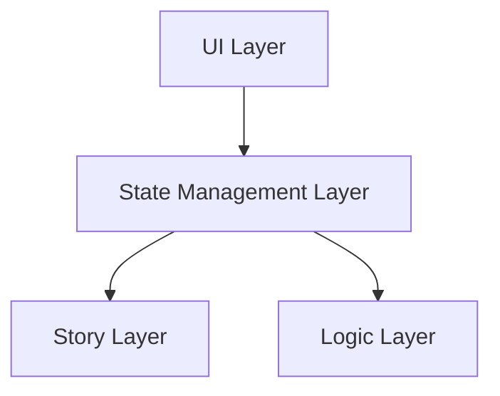

![5E compatible](https://img.shields.io/badge/5E%20compatible-1e1e1e?style=for-the-badge&logo=data:image/svg+xml;base64,PHN2ZyB4bWxucz0iaHR0cDovL3d3dy53My5vcmcvMjAwMC9zdmciIHdpZHRoPSIyNCIgaGVpZ2h0PSIyNCIgdmlld0JveD0iMCAwIDI0IDI0Ij48cGF0aCBmaWxsPSIjZmZjYTAwIiBkPSJtMjAuNDcgNi42MmwtNy45LTQuNDRDMTIuNDEgMi4wNiAxMi4yMSAyIDEyIDJzLS40MS4wNi0uNTcuMThsLTcuOSA0LjQ0Yy0uMzIuMTctLjUzLjUtLjUzLjg4djljMCAuMzguMjEuNzEuNTMuODhsNy45IDQuNDRjLjE2LjEyLjM2LjE4LjU3LjE4cy40MS0uMDYuNTctLjE4bDcuOS00LjQ0Yy4zMi0uMTcuNTMtLjUuNTMtLjg4di05YzAtLjM4LS4yMS0uNzEtLjUzLS44OG0tOS4wMiA5LjM0bC01LjE0LS4wM3YtMS4wMnMzLjQzLTMuMzMgMy40NC00LjM0YzAtMS4yNC0xLjAyLTEuMTEtMS4wMi0xLjExcy0uOTguMDQtMS4wOSAxLjI1bC0xLjUuMDVzLjA0LTIuNSAyLjY5LTIuNWMyLjM3IDAgMi40IDEuNzggMi40IDIuMjRjMCAxLjY4LTMuMDggNC4yNy0zLjA4IDQuMjdsMy4zLS4wMXptNi4wNS0yLjQ2YzAgMS40LTEuMTUgMi41NS0yLjU3IDIuNTVjLTEuNDMgMC0yLjU3LTEuMTUtMi41Ny0yLjU1di0yLjY2YzAtMS40MiAxLjE0LTIuNTcgMi41Ny0yLjU3czIuNTcgMS4xNSAyLjU3IDIuNTd6TTE2IDEwLjc3djIuNzZjMCAuNTktLjUgMS4wNy0xLjA4IDEuMDdzLTEuMDYtLjQ4LTEuMDYtMS4wN3YtMi43NmMwLS41OS40OC0xLjA2IDEuMDYtMS4wNnMxLjA4LjQ3IDEuMDggMS4wNiIvPjwvc3ZnPg== '5E compatible')


# Nameless Circle

[](https://github.com/Wesley-Nunes/nameless-circle/actions/workflows/vitest_tests.yaml)
[](https://github.com/Wesley-Nunes/nameless-circle/actions/workflows/cypress_tests.yaml)

Nameless Circle is a text-based RPG that uses immersive storytelling and strategic gameplay to deliver a unique dark fantasy experience.

## Table of Contents

- [Motivation](#motivation)
- [Design & Architecture](#design-and-architecture)
- [Tech Stack](#tech-stack)
- [How to Run](#how-to-run)
- [Testing Strategy](#testing-strategy)
- [UI/UX Design](#ui-ux-design)
- [Story](#story)
- [Preview](#preview)
- [Contributing](#contributing)
- [License](#license)
- [Author](#author)

## <a name="motivation">Motivation</a>

I'm developing this game to master the process of product creation — in this case, a game — and to showcase my skills.

As a solo indie developer, I have constraints, such as scope management and the necessity of diverse skills.  
I'm tackling these challenges by:

- **Balancing software development with a pragmatic approach**, applying principles like KISS, YAGNI, and Separation of Concerns. This is demonstrated through a data-oriented architecture, where game logic is implemented as pure functions that operate on simple, serializable data structures.
- **Utilizing established game mechanics,** like those present in the SRD 5E compatible.
- **Transforming a static, original dark fantasy story into an interactive narrative** using the ink scripting language.
- **Following a well-established and creative process** to achieve an aesthetic and functional design.
- **Implementing smart testing strategies** to prevent rework and ensure code quality.

## <a name="design-and-architecture">Design & Architecture</a>

To create a clean and scalable architecture, I divided the project into:

- [UI](./docs/ui.md)
- [Logic](./docs/logic.md)
- [State Management](./docs/state-management.md)
- [Story](./docs/story.md)



Enabling me to keep the codebase simple with concerns separated and easily maintainable.

## <a name="tech-stack">Tech Stack</a>

| Area                   | Technology                   |
| :--------------------- | :--------------------------- |
| **Frontend Framework** | React, TypeScript            |
| **Narrative Engine**   | Ink, Inkjs                   |
| **Testing**            | Cypress (E2E), Vitest (Unit) |
| **Build Tool**         | Vite                         |
| **Styling**            | CSS Modules                  |
| **UI/UX Design**       | Penpot                       |
| **Deployment**         | Vercel                       |

## <a name="how-to-run">How to Run & Requirements</a>

### Requirements

- [Node.js](https://nodejs.org/en/download) (developed with **Node.js 22.x**)

### Getting Started

```bash
# 1. Clone the repo
git clone git@github.com:Wesley-Nunes/nameless-circle.git
cd nameless-circle

# 2. Install dependencies
npm install
```

### Running the project

After installing dependencies, you can run the following scripts:

#### Development

```bash
# 1. Starts the local development server
npm run dev
```

> - The game will be available on: `http://localhost:5173`

#### Production Build

```bash
# 1. Build the static bundle
npm run build

# 2. Preview the production build locally
npm run preview
```

> - The preview will be available on `http://localhost:4173`

#### Tests

```bash
# Run unit tests in watch mode
npm run test:unit
```

```bash
# Run unit tests once
npm run test:unit:ci
```

```bash
# Open the Cypress App
npm run test:e2e
```

```bash
# Run all E2E tests headlessly
npm run test:e2e:ci
```

## <a name="testing-strategy">Testing Strategy</a>

This project follows the testing pyramid to ensure robustness and prevent regression while maintaining development speed. The strategy is pragmatic, focusing tests on the most critical and complex parts of the application: the game logic and state management.

_For a deeper understanding of the layers under test, please refer to the [Design & Architecture](#design-and-architecture) section._

| Test Level           | Scope                     | Tools   | Description                                                                                                                                                                                             |
| :------------------- | :------------------------ | :------ | :------------------------------------------------------------------------------------------------------------------------------------------------------------------------------------------------------ |
| **Unit**             | Pure Game Logic Functions | Vitest  | The game mechanics are implemented as pure functions. These are extensively unit tested to ensure they behave exactly as defined by the game rules.                                                     |
| **Integration**      | State Management (Stores) | Vitest  | The public methods of the state stores are tested to verify the stores correctly orchestrate the various functions to produce the expected changes in the game state.                                   |
| **End-to-End (E2E)** | Critical User Flows       | Cypress | Tests simulate a complete user journey. These tests validate that all application layers integrate correctly and protect key flows from regression.                                                     |
| **Component**        | UI Components             | Cypress | UI components (used inside the game) will be tested in isolation to verify their visual states and interaction handlers. **TBD after [#16](https://github.com/Wesley-Nunes/nameless-circle/issues/16)** |


## <a name="ui-ux-design">UI/UX Design</a>

The UI/UX was designed to complement the game's dark fantasy narrative and ensure an immersive, readable experience. The process was broken into four steps to maintain focus on the core content:

1.  **Consolidation:** All game text and ideas were organized into a single document using the 5W1H framework, resulting in a clear set of requirements and keywords.
2.  **Mood Boarding:** Keywords were used to create a mood board, establishing the project's visual direction and dark fantasy atmosphere.
3.  **Wireframing:** The most critical user flow — following the narrative — was wireframed on paper, prioritizing content layout and interaction.
4.  **High-Fidelity Design:** Wireframes were translated into detailed mockups using Penpot.

This approach ensured the design was driven by the story and gameplay needs, and it let me focus on game content and create a practical mobile-first design.

**Design Artifacts & Links:**

- [Project 5W1H & Keywords](https://docs.google.com/document/d/13Mi1sZpZwXe66AbvSeDS67OW2OKxNq6cmbg1xFXS908/edit?usp=sharing)
- [Mood Board](https://design.penpot.app/#/view?file-id=bd830f34-5ac9-8161-8006-c3262c9ac29a&page-id=614077e1-bf93-807e-8006-36fb7bda934e&section=interactions&index=0&share-id=bd830f34-5ac9-8161-8006-c32c3854ea8e)
- **Web App Mockups:**
    - [Home page](https://design.penpot.app/#/view?file-id=e7c79b0d-7aa0-808c-8006-c3262c815abf&page-id=889bdc0d-54d4-80a1-8006-a893f79e9c12&section=interactions&index=0&share-id=bd830f34-5ac9-8161-8006-c33267cb00b8)
    - [Welcome page](https://design.penpot.app/#/view?file-id=e7c79b0d-7aa0-808c-8006-c3262c815abf&page-id=f028ace2-19eb-8131-8006-a5ebc189c57b&section=interactions&index=0&share-id=bd830f34-5ac9-8161-8006-c332be8309ac)
    - [Game page](https://design.penpot.app/#/view?file-id=e7c79b0d-7aa0-808c-8006-c3262c815abf&page-id=889bdc0d-54d4-80a1-8006-a8703c940c42&section=interactions&index=0&share-id=e7c79b0d-7aa0-808c-8006-c332e9435004)

## <a name="story">Story</a>

_This section will be short because the story is growing and changing constantly._

The story is a dark fantasy where there are no purely good or evil characters. Everyone has their own motivations and points of view.  
The narrative is written around the prophecy — the first block of text in the game's current version - from this prophecy, I developed the story's central conflicts and foreshadowed its ending.

> I won't add any parts of the story here because they change daily.  
> In the future, I'll create a dedicated page within the app for the story.

## <a name="preview">Preview</a>

Play **[Nameless Circle](https://nameless-circle.vercel.app/)** 🎮 (v0.1.0)


## <a name="contributing">Contributing</a>

First off, thank you for your interest in contributing to this project! As a solo indie developer, I greatly appreciate any help, whether it's reporting a bug, suggesting a feature, or submitting code.

To know how could you contribute, please read [How to Contribute](./docs/CONTRIBUTING.md)

## <a name="license">License</a>

This project uses multiple licenses.

- **Code**: The source code in this repository is licensed under the **MIT License**
    - see the [LICENSE-CODE-MIT](./license/LICENSE-CODE-MIT.md) file for details.

        **Code location:**

        ```
        src/
        --game/*
        --state/*
        --ui/*
        ```

- **Story & Narrative:** All original story content, characters, and world-building are licensed under a **CC BY-NC-ND 4.0**
    - see the [LICENSE-STORY-CC-BY-NC-ND-4.0](./license/LICENSE-STORY-CC-BY-NC-ND-4.0.md) file for details.

        **Story location:**

        ```
        src/
        --story/*
        ```

- **Part of the game mechanic use**: SRD 5.2.1 content.
    - See [LICENSE-SRD-CC-BY-4.0](./license/LICENSE-SRD-CC-BY-4.0.md) for details.

## <a name="author">Author</a>

Developed by **Wesley Nunes**

- [GitHub](https://github.com/Wesley-Nunes/)
- [LinkedIn](https://www.linkedin.com/in/dev-wesley-nunes)
